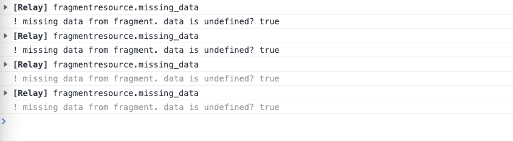
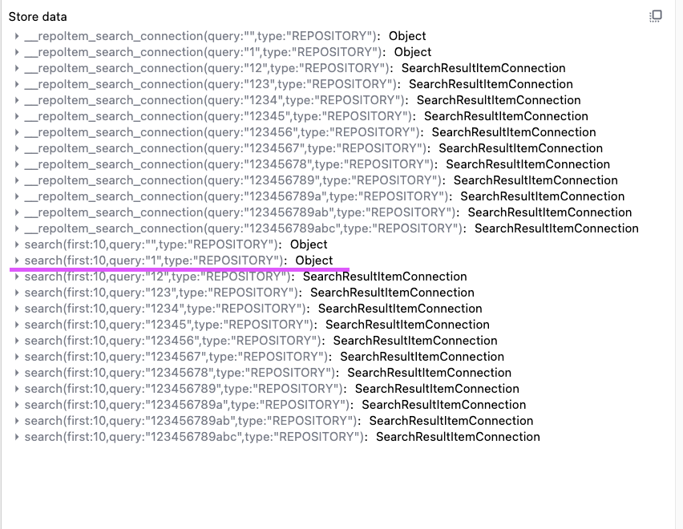
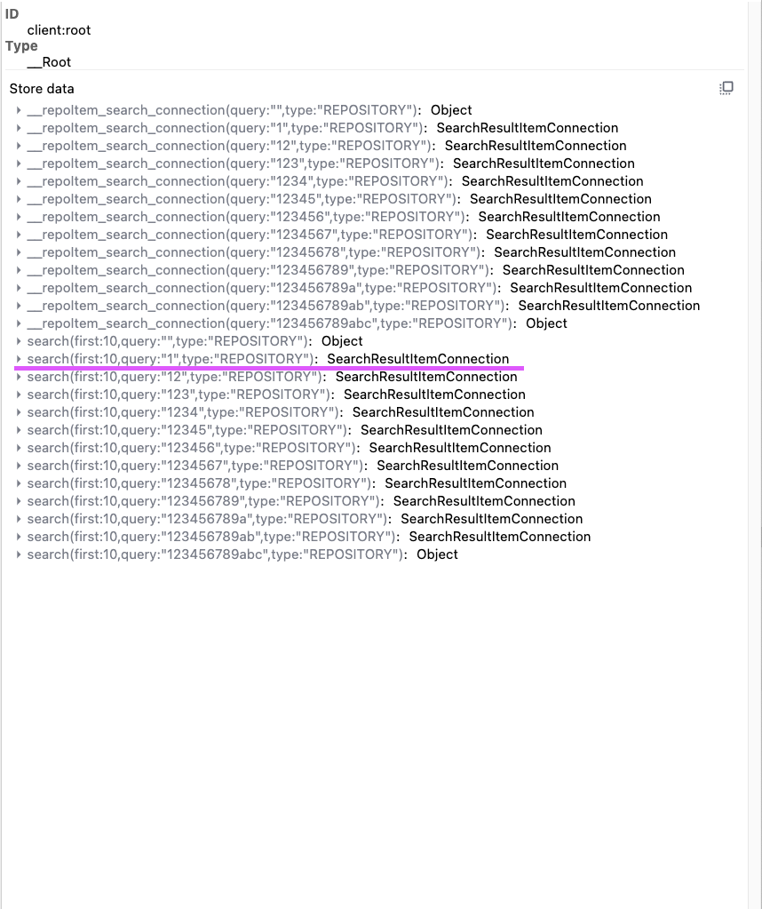

# Relay missing data bug

Repository for reproducing an issue where released data from cache is not
being refetched when using combination of `useLazyLoadQuery` + `usePaginationFragment`
hooks. See [the-problem](/#the-problem) section for more information.

## Installation

`npm install`

Copy and rename `.env.local.example` to `.env.local` and replace
`VITE_GITHUB_TOKEN` with your [personal access token](https://github.com/settings/tokens/new) (classic).

You need these permissions on token:
- `public_repo`
- `read:user`
- `user:email`

## Run

`npm run dev` will start local development server

## The problem

This repository demonstrates a specific problem that I encountered while fetching
data from Github API.

This sample application has an input that uses Github API to search through repositories.
When I type `123456789abc` into the input, multiple requests fire and eventually
finish without an error.

When I start deleting the characters from the input and I have only `1` left, there's
an unexpected `undefined` value in `data.search` fragment in `ResultList` component  . See example:

This is unexpected (for me) because the generated types for the pagination fragment
show that it should be `null`. But even in this case I would not expect this behaviour
and **I would expect that the missing data would be re-fetched instead**.

The reason why I know the data is missing is that I have a logging function that
prints out different types of Relay events and I get `fragmentresource.missing_data`
log which comes from [this part of the codebase](https://github.com/facebook/relay/blob/main/packages/react-relay/relay-hooks/FragmentResource.js#L492):

Data not being in the cache is not an issue and it is expected behaviour. I'm using
default settings for Relay which means the garbage collector is set to retain 10
items in the cache and use `store-or-network` fetch policy and indeed it's something
that seems to happen in my case. This is video from Relay dev tools and I can see
how the cached connection switches to `Object` once the older data is discarded:

The `search(first: 10, query: "1", type: REPOSITORY)` data is released as the string
in input box grows.

**It does not explain why the data is not being refetched.** From the log message
it seems Relay is aware of missing data but does not try to redownload it, why?
Adding checks if data is there or not seems like overly defensive programming.

**It seems like this problem only occurs when multiple parallel requests are
fired**. When I type one letter at a time so requests can finish, this problem
doesn't occur and data is actually refetched!

You can see it in action in this video:

Once I get to `1` in input, you can see in the video that refetch is fired. When
observing Relay cache via dev tools, the same thing happens as in the previous
situation, items get released but when the data is refetched, I can see
`SearchResultItemConnection` reappear in the cache:

I realize that in real-world scenarios you would want to throttle the input
and only fire the request when user stops typing but I still think Relay
should be robust enough to handle these cases.

I know I could bump-up the garbage collector retain size but it wouldn't help
in this situation as I would eventually run into the problem depending on the
size of the string in the input.

I tried replacing `useLazyLoadQuery` hook with `useQueryLoader` + `usePreloadedQuery`
and passing the reference to the component with pagination. This _fixes_ the issue
**but** it's not what I'm looking for. According to documentation, `usePreloadedQuery`
retains items in the cache as long as the component is mounted. However this could lead
to memory issues if someone is using the input for too long so I actually think
`useLazyLoadQuery` is more appropriate here.
